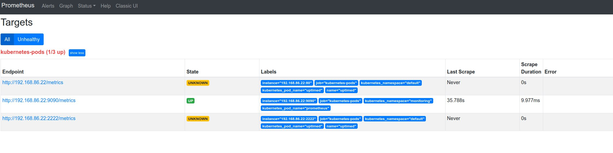

# Systemk: virtual kubelet for systemd

This is a virtual kubelet provider that uses systemd as its backend.

Every Linux system has systemd nowadays. By utilizing [K3s](https://k3s.io) (just one Go binary)
and this virtual kubelet you can provision a system using the Kubernetes API. The networking is the
host's network, so it make sense to use this for more heavy weight (stateful?) applications. The
filesystem is semi hidden, but emptyDir and the like works.

It is hoped this setup allows you to use the Kubernetes API without the need to immerse yourself in
the (large) world of kubernetes (overlay networking, ingress objects, etc., etc.). However this
_does_ imply networking and discovery (i.e. host) DNS is already working on the system you're
deploying this. How to get a system into a state it has, and can run, k3s and systemk is an open
questions (Ready made image? A tiny bit of config mgmt?).

Systemk will use systemd to start pods as service unit(s). This uses the cgroup implementation
systemd has. This allows us to set resource limits, by specifying those in the unit file (copy paste
from the podSpec almost). Generally there is no (real container) isolation in this setup - although
for disk access things are fairly contained, i.e. `/var/secrets/kubernets.io/token` will be bind
mounted into each unit.

You basically use the k8s control plane to start linux processes. There is also no address space
allocated to the PODs specially, you are using the host's networking.

"Images" are referencing (Debian) packages, these will be apt-get installed. Discovering that an
installed package is no longer used is hard, so this will not be done. `systemk` will reuse the unit
file that comes from this install, almost exclusively to find the `ExecStart` option.
A lot of extra data is injected into it to make it work fully for systemk. If there isn't an unit
file (e.g. you use `bash` as the image), a unit file will be synthesized.

Each scheduled unit will adhere to a naming scheme so `systemk` knows which ones are managed by it.

## Is This Useful?

Likely. I personally consider this useful enough to manage a small farm of machines. Say you
administer 200 machines and you need saner management and introspection than config management
can give you? I.e. with `kubectl` you can find which machines didn't run a DNS server, with
*deployments* you can more safely push out upgrades, with "insert favorite Kubernetes feature here"
you can do canarying.

Monitoring, for instance, only requires prometheus to discover the pods via the Kubenetes API,
vastly simplifying that particular setup. See
[prometheus.yaml](https://github.com/virtual-kubelet/systemk/blob/main/k3s/prometheus.yaml) for a
complete, working, setup that discovers running Pods and scrapes them. The prometheus config is
*just* `kubernetes_sd_configs`.

Currently I manage 2 (Debian) machines and this is all manual - i.e.: login, apt-get upgrade, fiddle
with config files etc. It may turn of that k3s + systemk is a better way of handling even *2* machines.

Note that getting to the stage where this all runs, is secured and everything has the correct TLS
certs (that are also rotated) is an open question. See https://github.com/miekg/systemk/issues/39 for
some ideas there.

## Current Status

Multiple containers in a pod can be run and they can see each others storage. Creating, deleting,
inspecting Pods all work. Higher level abstractions (replicaset, deployment) work too. Init
Containers are also implemented.

EmptyDir/configMap/hostPath and Secret are implemented, all, except hostPath, are backed by a
bind-mount. The entire filesystem is made available, but read-only, paths declared as volumeMounts
are read-only or read-write depending on settings. When configMaps and Secrets are mutated the new
contents are updated on disk.

Getting logs also works, but the UI for it could be better; this mostly due to TLS certificates not
being generated.

Has been tested on:

* ubuntu 20.04 and 18.04
* arch (maybe?)

## Building

Use `go build` in the top level directory, this should give you a `systemk` binary which is the virtual
kubelet.

## Design

Pods can contain multiple containers; each container is a new unit and tracked by systemd. The named
image is assumed to be a *package* and will be installed via the normal means (`apt-get`, etc.). If
systemk is installing the package the official system unit will be disabled; if the package already
exists we leave the existing unit alone. If the install doesn't come with a unit file (say you
install `zsh`) we will synthesize a small service unit file; for this to work the podSpec need to
(at) least define a command to run.

CreatePod call we call out to systemd to create a unit per container in the pod. Each unit will
be named `systemk.<pod-namespace>.<pod-name>.<image-name>.service`. If a command is given it will
replace the first word of `ExecStart` and leave any options there. If `args` are also given the
entire `ExecStart` is replaced with those. If only `args` are given the command will remain and only
the options/args will be replaced.

We store a bunch of k8s meta data inside the unit in a `[X-kubernetes]` section. Whenever we want to
know a pod state systemk will query systemd and read the unit file back. This way we know the status
and have access to all the meta data, like pod UID and if the unit is an init container.

### Specifying Images

In general the image you specify is a (distro) package, i.e. `bash-$version.deb`. But there are
alternatives that can be used and give you some flexibility.

#### Fetching Image Remotely

If the image name starts with `https://` it is assumed an URL and the package is fetched from there
and installed. The image name is the first string up until the `_` in the package name:
`https://example.org/tmp/coredns_1.7.1-bla_amd64.deb` will download the package from that URL and
`coredns` will be the package name.

#### Binary Exists in File System

If the image name starts with a `/` it's assumed to be a path to a binary that exists on the system,
nothing is installed in that case. Basically this tells systemk that the image is not used. This can
serve as documentation. It's likely command and/or args in the podspec will reference the same path.

This mode helps in running systemk as a non-root user.

### Addresses

Addresses are configured with one the systemk command line flags: `--node-ip` and
`--node-external-ip`, these may be IPv4 or IPv6. In the future this may get expanded into allow both
(i.e. dual stack support). The primary Pod address will be the value from `--node-external-ip`.

If `--node-ip` is not given, systemk will try to find a RFC 1918 address on the interfaces and uses the
first one found.

If `--node-external-ip` is not given, systemk will try to find a non-RFC 1918 address on the
interfaces and uses the first one found.

If after all this one of the values is still not found, the other existing value will be copied, i.e
internal == external in that case. If both were empty systemk exits with a fatal error.

### Environment Variables

The following environment variables are made available to the units:

* `HOSTNAME`, `KUBERNETES_SERVICE_PORT` and `KUBERNETES_SERVICE_HOST` (same as the kubelet).
* `SYSTEMK_NODE_INTERNAL_IP` the internal IP address.
* `SYSTEMK_NODE_EXTERNAL_IP` the external IP address.

### Using username in securityContext

To specify an *username* in a securityContext you need to use the `windowsOptions`:
~~~
spec:
  securityContext:
    windowsOptions:
      runAsUserName: "prometheus"
~~~
The primary group will be found by systemk and both a `User` and `Group` will be injected into the
unit file. The files created on disk for the configMap/secrets/emptyDir will be made of the same
user/group.

### Restricting mount points

You can restrict the allowed mounts points for the pod's volumes. By default mounts under "/var" are
allowed, but this can be changed via the `--dir` or `-d` flag.

### Running Without Root Permissions

Some work has been done to be able to run `systemk` without root permissions. This means a couple of
things:

1. Packages can't be installed, so you'll need to use a path as the image name (See "Binary Exists in
   File System").
2. A user systemd must be running with the same uid as systemk.
3. Systemk must be started with the right set of capabilities:
   `% sudo capsh --caps="cap_chown,cap_setuid,cap_setgid+ep" --user=$UID -- -c "$PWD/systemk -u --kubeconfig $CONFIG"`
   Or an equivalent systemd unit file.
   Note when running a graphical session in Linux you probably have a user systemd already running,
   connecting to that instance requires `cap_sys_admin` to be set as well.

**Note:** this feature is experimental and we may remove it if it turns to be too cumbersome.

### Limitations

By using systemd and the host's network stack we have weak isolation between pods, i.e. no more
than process isolation. Starting two pods that use the same port is guaranteed to fail for one.
To expand on this, everything is run as if `.spec.hostNetwork: true` is specified. Port clashes
are (probably?) more likely for health check ports. Two pods using the same (health check) port
thus can't schedule on the same machine. We have some ideas to get around this (like generating
an environment variable with a unique port number (or using `$RANDOM`) that can be used for health
checking, but are also open to suggestions, including not doing anything.

## Use with K3S

Download k3s from it's releases on GitHub, you just need the `k3s` binary. Use the `k3s/k3s` shell
script to start it - this assumes `k3s` sits in "~/tmp/k3s". The script starts k3s with basically
*everything* disabled.

Compile `systemk` and start it with.

~~~
sudo ./systemk --kubeconfig ~/.rancher/k3s/server/cred/admin.kubeconfig --disable-taint
~~~

We need root to be allowed to install packages.

Now a `k3s kubcetl get nodes` should show the virtual kubelet as a node:

~~~
NAME    STATUS   ROLES   AGE   VERSION   INTERNAL-IP   EXTERNAL-IP   OS-IMAGE            KERNEL-VERSION     CONTAINER-RUNTIME
draak   Ready    agent   6s    v1.18.4   <none>        <none>        Ubuntu 20.04.1 LT   5.4.0-53-generic   systemd 245 (245.4-4ubuntu3.3)
~~~

`draak` is my machine's name. You can now try to schedule a pod: `k3s/kubelet apply -f
k3s/uptimed.yaml`.

Logging works, but due to TLS, is a bit fiddly, you need to start `systemk` with --certfile and
--keyfile to make the HTTPS endpoint happy (enough). Once that's done you can get the logs with:

~~~
% ./kubectl logs --insecure-skip-tls-verify-backend=true uptimed
-- Logs begin at Mon 2020-08-24 09:00:18 CEST, end at Thu 2020-11-19 15:40:02 CET. --
nov 19 12:12:27 draak systemd[1]: Started uptime record daemon.
nov 19 12:14:44 draak uptimed[15245]: uptimed: no useable database found.
nov 19 12:14:44 draak systemd[1]: Stopping uptime record daemon...
nov 19 12:14:44 draak systemd[1]: systemk.default.uptimed.uptimed.service: Succeeded.
nov 19 12:14:44 draak systemd[1]: Stopped uptime record daemon.
nov 19 13:38:54 draak systemd[1]: Started uptime record daemon.
nov 19 13:39:26 draak systemd[1]: Stopping uptime record daemon...
nov 19 13:39:26 draak systemd[1]: systemk.default.uptimed.uptimed.service: Succeeded.
~~~

### Prometheus discovering targets to Scrape

The includes manifests `k3s/prometheus.yaml` and `k3s/uptimed.yaml` install a prometheus with k8s
support and the uptimed. This allows prom to find the open ports for uptimed and will start scraping
those for metrics (uptimed doesn't have metrics, but that's a minor detail). Here is the status of
prom finding those targets and trying to scrape:



### Debian/Ubuntu

1. Install *k3s* and compile the virtual kubelet.

I'm using `uptimed` as a very simple daemon that you (probably) haven't got installed, so we can
check the entire flow.

3. `./k3s/kubectl apply -f uptimed.yaml`

The above *should* yield:

~~~
NAME      READY   STATUS    RESTARTS   AGE
uptimed   1/1     Running   0          7m42s
~~~

You can then delete the pod.

## Testing

### Set-up Node authentication

`systemk` impersonates a Node and, as such, can identify itself through a TLS
client certificate.
Let's set that up.

1. Install `cert-manager`, required to provision a TLS certificate
that will later be used when authenticating `systemk` as a Kubernetes Node.

    ```bash
    kubectl apply -f https://github.com/jetstack/cert-manager/releases/download/v1.1.0/cert-manager.yaml
    ```

1. Expose private CA resources as a Secret, a requirement for the next step.

    1. If using `kind`:

       ```bash
       docker exec -e KUBECONFIG=/etc/kubernetes/admin.conf kind-control-plane sh -c \
          'kubectl -n cert-manager create secret tls priv-ca \
          --cert=/etc/kubernetes/pki/ca.crt \
          --key=/etc/kubernetes/pki/ca.key'
       ```

   1. If using `minikube`:

      ```bash
      minikube ssh

      sudo /var/lib/minikube/binaries/v1.20.1/kubectl \
        --kubeconfig /etc/kubernetes/admin.conf \
        -n cert-manager create secret tls priv-ca \
        --cert=/var/lib/minikube/certs/ca.crt \
        --key=/var/lib/minikube/certs/ca.key

      exit
      ```

1. Create a cluster-wide certificate issuer that re-uses the cluster PKI.

    ```bash
    cat <<EOF | kubectl apply -f -
    apiVersion: cert-manager.io/v1
    kind: ClusterIssuer
    metadata:
      name: priv-ca-issuer
    spec:
      ca:
        secretName: priv-ca
    EOF

    kubectl wait --for=condition=Ready --timeout=1m clusterissuer priv-ca-issuer
    ```

1. Create a certificate signing request that `cert-manager` can sign with the
   CA setup during your Kubernetes cluster bootstrap.

    ```bash
    NODENAME=systemk
    cat <<EOF | kubectl apply -f -
    apiVersion: cert-manager.io/v1
    kind: Certificate
    metadata:
      name: $NODENAME
      namespace: default
    spec:
      secretName: $NODENAME-tls
      duration: 8760h # 1 year
      renewBefore: 4380h # 6 months
      subject:
        organizations:
        - system:nodes
      commonName: system:node:$NODENAME
      issuerRef:
        name: priv-ca-issuer
        kind: ClusterIssuer
    EOF

    kubectl wait --for=condition=Ready --timeout=1m certificate $NODENAME
    ```

1. Initialize a _kubeconfig_ file `systemk` will rely on.

   1. If using `kind`:

      ```bash
      rm -f $NODENAME.kubeconfig
      kind get kubeconfig > $NODENAME.kubeconfig

      kubectl --kubeconfig=$NODENAME.kubeconfig config unset contexts.kind-kind
      kubectl --kubeconfig=$NODENAME.kubeconfig config unset users.kind-kind
      ```

   1. If using `minikube`:

      ```bash
      rm -f $NODENAME.kubeconfig
      KUBECONFIG=$NODENAME.kubeconfig minikube update-context

      kubectl --kubeconfig=$NODENAME.kubeconfig config unset contexts.minikube
      kubectl --kubeconfig=$NODENAME.kubeconfig config unset users.minikube
      ```

1. Extract the signed certificate and respective private key, and populate the
   _kubeconfig_ file, appropriately.

   ```bash
   kubectl get secret $NODENAME-tls -o jsonpath='{.data.tls\.crt}' | base64 -d > $NODENAME.crt
   kubectl get secret $NODENAME-tls -o jsonpath='{.data.tls\.key}' | base64 -d > $NODENAME.key

   kubectl --kubeconfig=$NODENAME.kubeconfig config set-credentials $NODENAME \
    --client-certificate=$NODENAME.crt \
    --client-key=$NODENAME.key

   kubectl --kubeconfig=$NODENAME.kubeconfig config set-context $NODENAME --cluster=minikube --user=$NODENAME
   kubectl --kubeconfig=$NODENAME.kubeconfig config use-context $NODENAME
   ```
### Running the Node

1. Allow `systemk` to view ConfigMaps and Secrets across the cluster.
   This is far from ideal but works for now.

   ```bash
   kubectl create clusterrolebinding $NODENAME-view --clusterrole=system:node --user=system:node:$NODENAME
   ```

1. Finally, start `systemk`.

   ```bash
   NODENAME=systemk
   ./systemk --kubeconfig=$NODENAME.kubeconfig --nodename=$NODENAME
   ```
